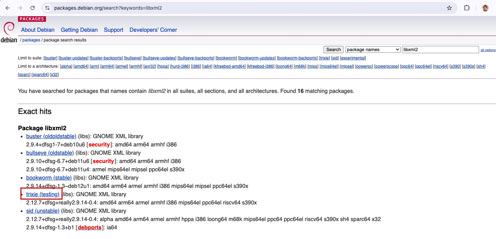

# nightly build fix #20250422

## 📚 Table of Contents

- [Overview](#-overview)
- [Issue](#-issue)
- [Identification](#-identification)
- [Solution](#-solution)

## 🧰 Overview 
_This space consists of identification and fix for the nightly failure issue during Easter 2025 caused due to unavailable libxml2._

## ✨ Issue

During the nighly and normal build of the images, a failure with below dependency error was observed:

```bash
[.build/kvm_dev-arm64-today-17bc0f34.tar 2025-04-22 09:31:56] The following packages have unmet dependencies:
[.build/kvm_dev-arm64-today-17bc0f34.tar 2025-04-22 09:31:56]  libxml2 : Depends: libicu72 (>= 72.1~rc-1~) but it is not installable
[.build/kvm_dev-arm64-today-17bc0f34.tar 2025-04-22 09:31:56] E: Unable to correct problems, you have held broken packages.
[.build/kvm_dev-arm64-today-17bc0f34.tar 2025-04-22 09:31:56] E: The following information from --solver 3.0 may provide additional context:
[.build/kvm_dev-arm64-today-17bc0f34.tar 2025-04-22 09:31:56]    Unable to satisfy dependencies. Reached two conflicting decisions:
[.build/kvm_dev-arm64-today-17bc0f34.tar 2025-04-22 09:31:56]    1. libxml2:arm64 is selected for install because:
[.build/kvm_dev-arm64-today-17bc0f34.tar 2025-04-22 09:31:56]       1. dnsutils:arm64=1:9.20.4-4gl0 is selected for install
[.build/kvm_dev-arm64-today-17bc0f34.tar 2025-04-22 09:31:56]       2. dnsutils:arm64 Depends bind9-dnsutils
[.build/kvm_dev-arm64-today-17bc0f34.tar 2025-04-22 09:31:56]       3. bind9-dnsutils:arm64 Depends bind9-libs (= 1:9.20.4-4gl0)
[.build/kvm_dev-arm64-today-17bc0f34.tar 2025-04-22 09:31:56]       4. bind9-libs:arm64 Depends libxml2 (>= 2.7.4)
[.build/kvm_dev-arm64-today-17bc0f34.tar 2025-04-22 09:31:56]    2. libxml2:arm64 Depends libicu72 (>= 72.1~rc-1~)
[.build/kvm_dev-arm64-today-17bc0f34.tar 2025-04-22 09:31:56]       but none of the choices are installable:
[.build/kvm_dev-arm64-today-17bc0f34.tar 2025-04-22 09:31:56]       [no choices]
completed in 1 seconds
```

## 🚀 Identification

 * Identify if the package libxml2 belongs to imported package from Debian, then it would be included in the file below:
   - https://github.com/gardenlinux/repo/blob/main/package-imports 
   
 * If not imported, we build the package from source by ourselves identified by :
   - https://github.com/gardenlinux/package-<PACKAGE_NAME>
   - Eg: https://github.com/gardenlinux/package-libxml2 

## ⚙️ Solution
## ⚙️ Solution

We identify the source package and modify the way the package is built from source in 2 step procedure below:

  - https://packages.debian.org/search?keywords=libxml2 reports libxml2 is not available for "trixie" (unstable/stable)
  

```bash
 git clone https://github.com/gardenlinux/package-build
```

  - In this case,
     - we need to alter the prepare source and
     - update the procedure to build the package
     - using apt_src instead of Debian git src
  - Ref: https://github.com/gardenlinux/package-build/bin/source (apt_src Usage)

 ```bash
 git clone https://github.com/gardenlinux/package-libxml2
```
**Fix::** 
   - https://github.com/gardenlinux/package-libxml2/pull/3
   - https://github.com/gardenlinux/package-libxml2/commit/247c84c2966b99636d55e93cf8ddcf081ee3adf7
   - The above would ideally now fix the libxml2 package build during Image creation
---
